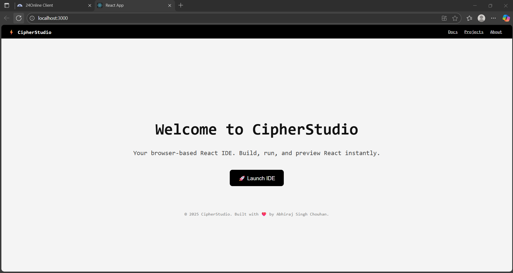
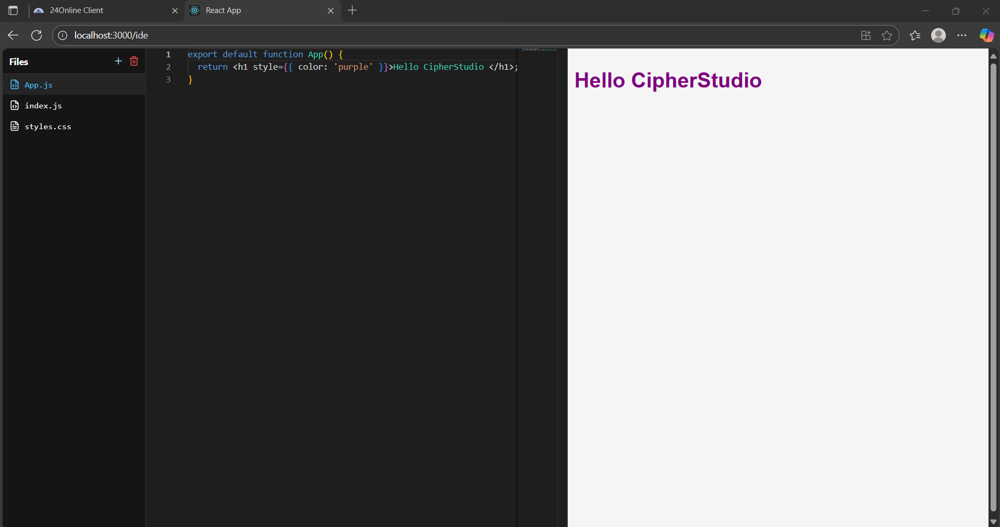
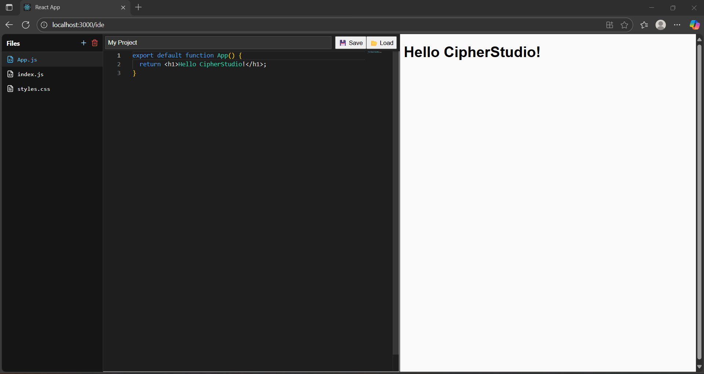

⚡ CipherStudio: A Browser-Based React IDE
CipherStudio is a full-stack web application that functions as a simple, in-browser Integrated Development Environment (IDE) for building and previewing React components. It uses the Monaco Editor (the engine behind VS Code) for a familiar coding experience and a sandboxed iframe for live, isolated previews.

This project is built on the MERN stack (MongoDB, Express.js, React, Node.js) and includes user authentication to save and load projects.
## Project Structure

```
cipherstudio/
  backend/
    middleware/
      auth.js
    models/
      project.js
      user.js
    routes/
      authRoutes.js
      projectRoutes.js
    server.js
    package.json
  frontend/
    public/
    src/
      api.js
      components/
        FileExplorer.jsx
        IDE.jsx
        Landing.jsx
        Login.jsx
        ProjectManager.jsx
      App.js
    package.json
  README.md
```

---

## ⚙️ Setup

### Prerequisites
- Node.js 18+
- npm
- MongoDB (local) or a MongoDB Atlas connection string

### 1) Backend
From `backend/`:

```bash
cd backend
npm install
```

Create `.env` in `backend/`:

```bash
MONGODB_URI=mongodb://localhost:27017/
MONGODB_DBNAME=cipherstudio
JWT_SECRET=replace_with_a_strong_random_secret
PORT=5000
```

Start the API:

```bash
npm start
# runs server.js → http://localhost:5000
```

Notes:
- The backend reads `MONGODB_URI`, `MONGODB_DBNAME`, `JWT_SECRET`, `PORT`.
- Default API base when running locally: `http://localhost:5000/api`.

### 2) Frontend
From `frontend/`:

```bash
cd frontend
npm install
npm start
# CRA dev server → http://localhost:3000
```

Optional: create `.env` in `frontend/` to point to a non‑default API:

```bash
REACT_APP_API_BASE=https://your-api-host.example.com/api
```

The frontend uses `frontend/src/api.js`, which defaults to `http://localhost:5000/api`.

### Run both
Open two terminals:
- Terminal A → `backend/` → `npm start`
- Terminal B → `frontend/` → `npm start`

---

## 🔐 Authentication
- Register and login return a JWT.
- Send the token on subsequent requests as: `Authorization: Bearer <token>`.

---

## 🧭 API Reference
Base URL: `http://localhost:5000/api`

### Auth (`/auth`)
- `POST /register` → body: `{ email, password }` → returns `{ token, user }`
- `POST /login` → body: `{ email, password }` → returns `{ token, user }`

### Projects (`/projects`) — requires `Authorization: Bearer <token>`
- `GET /` → list projects for current user
- `POST /` → create project; accepts `{ name, files? }` and seeds defaults if `files` omitted
- `GET /:id` → fetch one project (owned by user)
- `PUT /:id` → update `{ name?, files? }`
- `DELETE /:id` → delete project

---

## 🖥️ UI Overview
- `Landing.jsx`: marketing page with quick links to Projects and Login.
- `ProjectManager.jsx`: list/create/open projects.
- `IDE.jsx` + `FileExplorer.jsx`: Monaco editor + right‑side live preview.
- `Login.jsx`: email/password auth flow.

---

## 📸 Screenshots




---

## 🧩 Troubleshooting
- Cannot connect to MongoDB: verify `MONGODB_URI` and that Mongo is reachable; check firewall/VPN.
- CORS errors: ensure frontend calls the correct API base. Set `REACT_APP_API_BASE` if needed.
- 401/403 responses: include `Authorization: Bearer <token>` header after login.

---

## 📜 License
MIT © 2025 Abhiraj Singh Chouhan

✨ Features
💻 In-Browser Code Editor: A rich text editor powered by @monaco-editor/react.

🪄 Live Preview: A sandboxed iframe that transpiles and renders your React code in real-time.

📁 File Explorer: A simple file tree to navigate between App.js, index.js, and styles.css.

🔐 User Authentication: Secure user registration and login using JWT (JSON Web Tokens) and bcrypt for password hashing.

💾 Save & Load Projects: Users can save their code to a MongoDB database and reload their projects from a personal dashboard.

🚀 Tech Stack
Frontend (Client)
React 18

React Router (react-router-dom): For client-side routing (/, /ide/:projectId, /login).

Monaco Editor (@monaco-editor/react): The core code editor.

Babel Standalone (@babel/standalone): For in-browser JSX and ES6 transpilation.

Axios: For making HTTP requests to the backend API.

Backend (Server)
Node.js: The runtime environment.

Express.js: The server framework for building the REST API.

MongoDB (with Mongoose): The NoSQL database to store user and project data.

JSON Web Tokens (jsonwebtoken): For stateless authentication.

Bcrypt.js (bcryptjs): For securely hashing user passwords.

CORS: To handle cross-origin requests between the client and server.

🛠️ Getting Started
Follow these instructions to get a copy of the project up and running on your local machine.

Prerequisites
Node.js (v18 or later)

npm (or yarn)

MongoDB Atlas Account: A free cloud database is required.

1. Backend Setup (/server)
Clone the repository:

Bash

git clone https://your-repo-url.com/project-name.git
cd project-name/server
Install server dependencies:

Bash

npm install
Create your environment file: Create a file named .env in the /server directory and add the following, replacing the placeholders with your own keys:

Code snippet

# Your MongoDB Atlas connection string
MONGO_URI=mongodb+srv://<username>:<password>@<cluster-url>/<db-name>

# A strong, random string for signing JWTs
JWT_SECRET=your_super_strong_secret_key_here

# Port for the backend
PORT=5000
Run the backend server:

Bash

# For development (watches for changes)
npm run dev

# For production
npm start
Your backend API will be running at http://localhost:5000.

2. Frontend Setup (Client)
Assuming your React app is in the root or a /client folder.

Navigate to the client directory (from the root folder):

Bash

# If your React app is in the root
cd .. 

# If it's in a /client folder
# cd ../client 
Install client dependencies:

Bash

npm install
Run the React app:

Bash

npm start
Your React development server will open at http://localhost:3001 (or your configured port).

📝 API Endpoints
All API routes are prefixed with /api.

Auth Routes (/api/auth)
POST /register: Register a new user.

POST /login: Log in a user and receive a JWT.

Project Routes (/api/projects)
Requires x-auth-token in header.

GET /: Get all projects for the logged-in user.

POST /: Create a new, default project.

GET /:id: Get a specific project by its ID.

PUT /:id: Save/update a project's files and name.

🔮 Future Improvements
S3 Integration: Move file storage from MongoDB strings to AWS S3 for better performance and scalability.

Dependency Management: Allow users to add npm packages.

Console Tab: Add a console panel to show console.log output and runtime errors from the iframe.

Sharable Projects: Create public, read-only links for projects.


