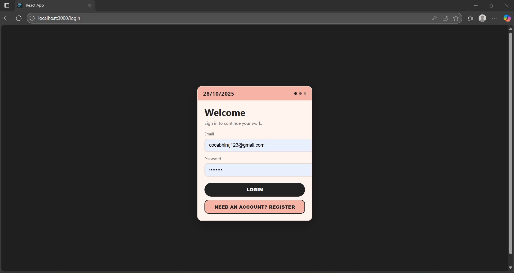

⚡ CipherStudio: A Browser-Based React IDE
CipherStudio is a full-stack web application that functions as a simple, in-browser Integrated Development Environment (IDE) for building and previewing React components. It uses the Monaco Editor (the engine behind VS Code) for a familiar coding experience and a sandboxed iframe for live, isolated previews.

video demonstrating - https://drive.google.com/file/d/1rcRpWb1x2kTK6moajYGvc5dYwsqdAbiH/view?usp=drive_link
This project is built on the MERN stack (MongoDB, Express.js, React, Node.js) and includes user authentication to save and load projects.
## Project Structure

```
cipherstudio/
  backend/
    middleware/
      auth.js
    models/
      project.js
      user.js
    routes/
      authRoutes.js
      projectRoutes.js
    server.js
    package.json
  frontend/
    public/
    src/
      api.js
      components/
        FileExplorer.jsx
        IDE.jsx
        Landing.jsx
        Login.jsx
        ProjectManager.jsx
      App.js
    package.json
  README.md
```

---

## ⚙️ Setup

### Prerequisites
- Node.js 18+
- npm
- MongoDB (local) or a MongoDB Atlas connection string

### 1) Backend
From `backend/`:

```bash
cd backend
npm install
```

Create `.env` in `backend/`:

```bash
MONGODB_URI=mongodb://localhost:27017/
MONGODB_DBNAME=cipherstudio
JWT_SECRET=replace_with_a_strong_random_secret
PORT=5000
```

Start the API:

```bash
npm start
# runs server.js → http://localhost:5000
```

Notes:
- The backend reads `MONGODB_URI`, `MONGODB_DBNAME`, `JWT_SECRET`, `PORT`.
- Default API base when running locally: `http://localhost:5000/api`.

### 2) Frontend
From `frontend/`:

```bash
cd frontend
npm install
npm start
# CRA dev server → http://localhost:3000
```

Optional: create `.env` in `frontend/` to point to a non‑default API:

```bash
REACT_APP_API_BASE=https://your-api-host.example.com/api
```

The frontend uses `frontend/src/api.js`, which defaults to `http://localhost:5000/api`.

### Run both
Open two terminals:
- Terminal A → `backend/` → `npm start`
- Terminal B → `frontend/` → `npm start`

---

## 🔐 Authentication
- Register and login return a JWT.
- Send the token on subsequent requests as: `Authorization: Bearer <token>`.

---

## 🧭 API Reference
Base URL: `http://localhost:5000/api`

### Auth (`/auth`)
- `POST /register` → body: `{ email, password }` → returns `{ token, user }`
- `POST /login` → body: `{ email, password }` → returns `{ token, user }`

### Projects (`/projects`) — requires `Authorization: Bearer <token>`
- `GET /` → list projects for current user
- `POST /` → create project; accepts `{ name, files? }` and seeds defaults if `files` omitted
- `GET /:id` → fetch one project (owned by user)
- `PUT /:id` → update `{ name?, files? }`
- `DELETE /:id` → delete project

---

## 🖥️ UI Overview
- `Landing.jsx`: marketing page with quick links to Projects and Login.
- `ProjectManager.jsx`: list/create/open projects.
- `IDE.jsx` + `FileExplorer.jsx`: Monaco editor + right‑side live preview.
- `Login.jsx`: email/password auth flow.

---

## 📸 Screenshots




---

## 🧩 Troubleshooting
- Cannot connect to MongoDB: verify `MONGODB_URI` and that Mongo is reachable; check firewall/VPN.
- CORS errors: ensure frontend calls the correct API base. Set `REACT_APP_API_BASE` if needed.
- 401/403 responses: include `Authorization: Bearer <token>` header after login.

---


🔮 Future Improvements
S3 Integration: Move file storage from MongoDB strings to AWS S3 for better performance and scalability.

Dependency Management: Allow users to add npm packages.

Console Tab: Add a console panel to show console.log output and runtime errors from the iframe.

Sharable Projects: Create public, read-only links for projects.


## 🖥️ Run this project on your computer

- **Prerequisites**
  - Node.js 18+ and npm
  - MongoDB (local) or a MongoDB Atlas connection string

- **Clone the repo**
  - PowerShell:
    ```bash
    git clone https://github.com/ajokbyy/cipherstudio_new.git
    cd cipherstudio_new
    ```

- **Backend setup**
  - PowerShell:
    ```bash
    cd backend
    npm install
    ```
  - Create a `.env` file in `backend/`:
    ```bash
    MONGODB_URI=mongodb://localhost:27017/
    MONGODB_DBNAME=cipherstudio
    JWT_SECRET=replace_with_a_strong_random_secret
    PORT=5000
    ```
    - If using MongoDB Atlas: set `MONGODB_URI` to your Atlas connection string.
  - Start the API:
    ```bash
    npm start
    ```
    - API runs at http://localhost:5000 (base: http://localhost:5000/api)

- **Frontend setup (new terminal)**
  - PowerShell:
    ```bash
    cd frontend
    npm install
    ```
  - Optional: if your API is not at http://localhost:5000, create `frontend/.env`:
    ```bash
    REACT_APP_API_BASE=http://YOUR_API_HOST:PORT/api
    ```
  - Start the app:
    ```bash
    npm start
    ```
    - Opens http://localhost:3000

- **Log in and use**
  - Register a user on the frontend, which stores a JWT in localStorage
  - Create projects, edit in the Monaco editor, and they’ll save to MongoDB

- **Troubleshooting**
  - Mongo errors: verify `MONGODB_URI` and that MongoDB is reachable
  - CORS/401: ensure `REACT_APP_API_BASE` matches your backend and the Authorization header is sent after login
  - Windows Firewall: allow Node.js for ports 3000 and 5000

Reference: [`github.com/ajokbyy/cipherstudio_new`](https://github.com/ajokbyy/cipherstudio_new/tree/main)

---

## 📜 License
MIT © 2025 Abhiraj Singh Chouhan

✨ Features
💻 In-Browser Code Editor: A rich text editor powered by @monaco-editor/react.

🪄 Live Preview: A sandboxed iframe that transpiles and renders your React code in real-time.

📁 File Explorer: A simple file tree to navigate between App.js, index.js, and styles.css.

🔐 User Authentication: Secure user registration and login using JWT (JSON Web Tokens) and bcrypt for password hashing.

💾 Save & Load Projects: Users can save their code to a MongoDB database and reload their projects from a personal dashboard.

